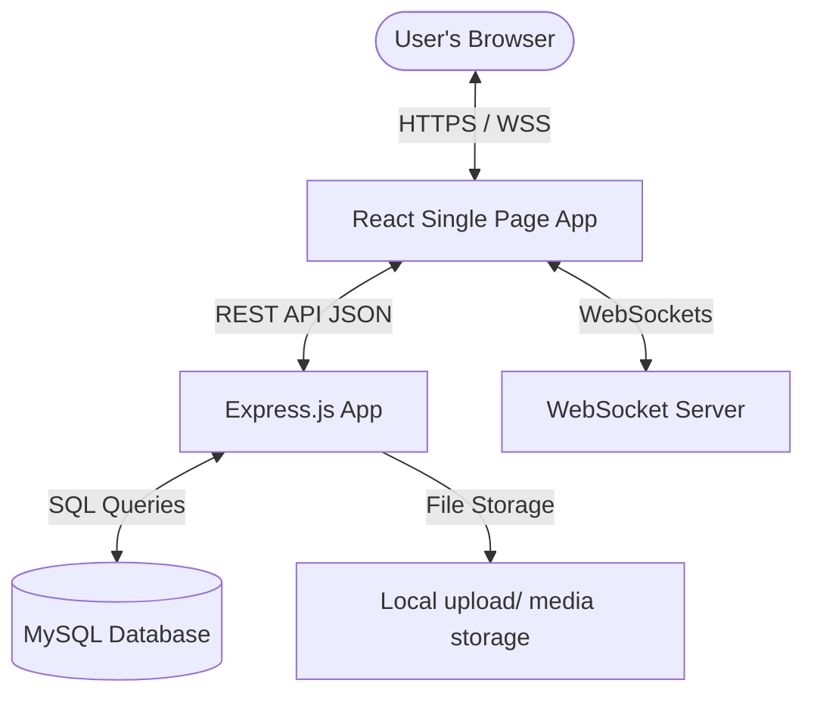
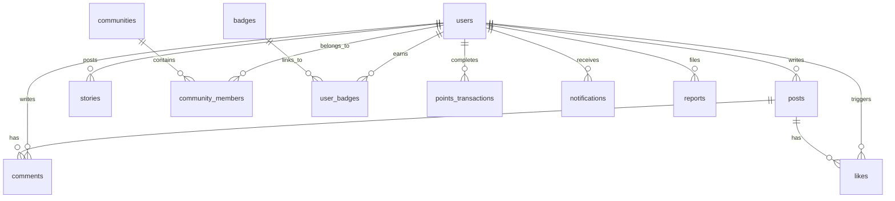
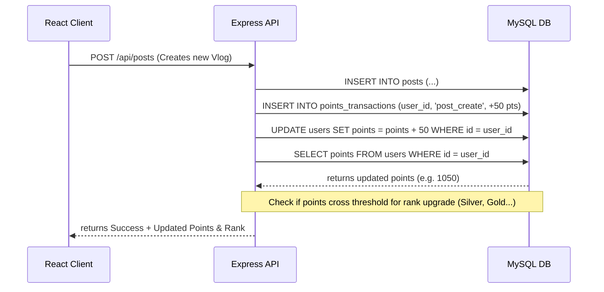
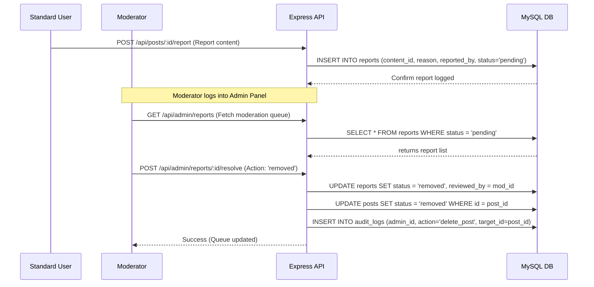

# Technical Architecture Document - MindManthan

This document describes the design architecture, database configurations, and communication layouts for the MindManthan full-stack web application.

---

## 1. System Overview

MindManthan is built using a decoupled Client-Server architecture:
* **Frontend Client**: React.js SPA initialized with Vite, styled using Tailwind CSS.
* **Backend Server**: RESTful API and WebSocket server built using Node.js and Express.js.
* **Database**: MySQL database storing users, posts, communities, gamification logs, and administration data.
* **Storage**: Local uploads folder (or cloud S3-compatible service) storing uploaded post assets, stories, and avatars.



---

## 2. Directory Layout & Folder Structure

```
Community/
├── client/                     # Frontend Application
│   ├── public/                 # Static public assets
│   ├── src/
│   │   ├── assets/             # Brand logos, placeholder assets
│   │   ├── components/         # Reusable UI Blocks
│   │   │   ├── Common/         # Button, Input, Modal, Loader
│   │   │   ├── Feed/           # PostCard, CommentSection, PostCreator
│   │   │   ├── Home/           # HeroCarousel, StatsStrip, PromoCard
│   │   │   └── Layout/         # Header, BottomNav, Sidebar
│   │   ├── context/            # AuthContext, NotificationContext
│   │   ├── hooks/              # Custom React hooks (useFetch, useWebcam)
│   │   ├── pages/              # Main Route pages
│   │   │   ├── Home.jsx
│   │   │   ├── VlogsBlogs.jsx
│   │   │   ├── StoryViewer.jsx
│   │   │   ├── Communities.jsx
│   │   │   ├── Rewards.jsx
│   │   │   ├── AdminPanel.jsx
│   │   │   └── Auth.jsx
│   │   ├── App.jsx             # Routes & Global State wrappers
│   │   ├── index.css           # Tailwind system declarations
│   │   └── main.jsx
│   ├── tailwind.config.js
│   └── vite.config.js
│
└── server/                     # Backend API Server
    ├── src/
    │   ├── config/             # database.js, auth.js
    │   ├── controllers/        # Route controllers
    │   │   ├── authController.js
    │   │   ├── postController.js
    │   │   ├── communityController.js
    │   │   ├── rewardController.js
    │   │   └── adminController.js
    │   ├── middleware/         # authMiddleware.js, rbacMiddleware.js
    │   ├── routes/             # Route configurations
    │   └── app.js              # Express app initialize, WebSocket hook
    ├── uploads/                # Local asset files storage
    ├── schema.sql              # Database DDL structure script
    └── .env                    # Environment keys
```

---

## 3. Database Architecture (MySQL)

Below is the Entity Relationship Diagram (ERD) mapping the tables.



### Table Definitions

1. **`users`**: User records, credentials, and scores.
2. **`posts`**: Support feed vlogs, blogs, and images.
3. **`comments` & `likes`**: Core engagement tracking tables.
4. **`stories`**: Content expiring in 24 hours.
5. **`communities` & `community_members`**: Local advocacy group configurations.
6. **`badges` & `user_badges`**: Milestone tracking.
7. **`points_transactions`**: Ledger tracking actions that earned points.
8. **`notifications`**: User action alert logs.
9. **`reports`**: Moderation queues tracking offensive content.

---

## 4. Architectural Flows & Sequences

### 4.1. Gamification Points Accumulation



### 4.2. Moderation & Auditing Flow



---

## 5. Security & Access Control (RBAC)

Authorization is managed via **Role-Based Access Control (RBAC)** filters at the API level.

* **User Roles**: `user`, `moderator`, `admin` (super_admin).
* **Route Guards**:
  ```javascript
  // Middleware example to guard admin endpoints
  const verifyRole = (allowedRoles) => {
    return (req, res, next) => {
      if (!req.user || !allowedRoles.includes(req.user.role)) {
        return res.status(403).json({ error: "Access Denied" });
      }
      next();
    };
  };
  
  // Usage
  router.get('/admin/dashboard', verifyToken, verifyRole(['admin', 'moderator']), getDashboardStats);
  ```

---

## 6. Real-time Features (WebSockets)

A live WebSocket pipeline handles:
1. **Live Supporter Counter**: Broadcasts incremental count changes to all active clients whenever a user clicks "Support Now".
2. **Instant Notifications**: Pushes real-time alerts (new comments, mentions, likes) to connected users.
3. **Leaderboard updates**: Real-time push for changes in top-tier supporter standings.
