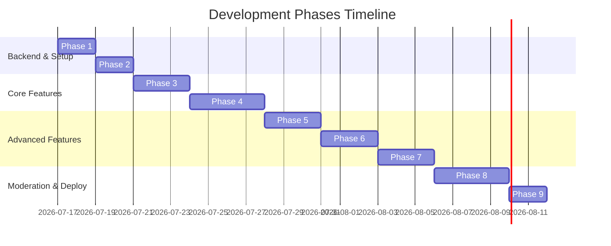

# Project Implementation Phases - MindManthan

This document outlines the detailed development roadmap for building and delivering the MindManthan platform.

---

## Roadmap Overview

---

## Detailed Phase Breakdown

### Phase 1: Project Setup & Database Migration
* **Goal**: Establish the repository scaffold, setup server dependencies, install Vite + Tailwind client, and verify local MySQL connection.
* **Tasks**:
  * Create folder structure (`client/` and `server/`).
  * Initialize `server/package.json` with `express`, `mysql2`, `dotenv`, `cors`, `jsonwebtoken`, `bcryptjs`, and `nodemon`.
  * Initialize `client/` using Vite React SPA and configure Tailwind CSS.
  * Write and run the initial `schema.sql` migration script to prepare the MySQL database.
* **Verification**:
  * Verify the server connects to MySQL.
  * Verify the Vite dev server launches successfully and renders a basic screen.

---

### Phase 2: Authentication Service
* **Goal**: Enable users to sign up, log in, and obtain access JWTs.
* **Tasks**:
  * Implement backend `/api/auth/signup` and `/api/auth/login`.
  * Build auth token verification middlewares.
  * Implement frontend client-side `AuthContext` to manage login state.
  * Create Auth Forms (Login / Signup pages) with Tailwind.
* **Verification**:
  * Verify token validation intercepts unauthorized REST actions.
  * Confirm login updates the UI state and saves user profiles.

---

### Phase 3: Home Page & Live Supporter Stats
* **Goal**: Build the primary dashboard showcasing campaign scale and support CTAs.
* **Tasks**:
  * Implement APIs to fetch stats (`GET /api/stats` or query database counts).
  * Build the frontend **Hero Banner Carousel** and **Stats Strip**.
  * Integrate simulated live updates for the "Supporter Count" (WebSocket mock or fetch intervals).
  * Implement `/api/auth/support-now` which lets users toggle support status and registers it.
* **Verification**:
  * Confirm clicking "Support Now" increments total supporters dynamically.

---

### Phase 4: Vlogs & Blogs Content Hub
* **Goal**: Enable creators to upload video vlogs and publish blog posts.
* **Tasks**:
  * Create backend post controllers (`POST /api/posts` for creating vlogs/blogs, `GET /api/posts` for feed queries).
  * Design media upload handler in backend (using `multer` or base64 streams).
  * Build frontend Vlogs & Blogs tabbed layout with independent list views.
  * Add search box to filter posts by hashtag.
  * Implement post interactions (likes, comments list, and bookmarking toggle).
* **Verification**:
  * Confirm vlogs stream successfully and comment sub-sections work correctly.

---

### Phase 5: Stories & Simulated Camera Filter
* **Goal**: Enable ephemeral, 24-hour visual updates and branded campaign frames.
* **Tasks**:
  * Create backend `/api/stories` endpoints (fetching unseen stories, creating stories).
  * Build Story ring indicators on the Home tab page.
  * Create the Fullscreen Story viewer component with slider controls.
  * Develop the Web Camera Filter component (utilizing standard canvas and overlay images).
* **Verification**:
  * Verify stories expire or are filtered out after 24 hours.
  * Test capturing a picture with a campaign overlay frame on the web.

---

### Phase 6: Communities & Local Chapters
* **Goal**: Support regional groups, chapter listings, and invitation referrals.
* **Tasks**:
  * Implement `/api/communities` controllers (listing by city, creating chapters, joining).
  * Generate referral link tokens and simulate QR Codes on the frontend.
  * Create chapter listing layouts with filter menus by region.
* **Verification**:
  * Verify that scanning a QR code or entering a referral registers the user.

---

### Phase 7: Gamification System
* **Goal**: Reward actions and list city/global leaderboards.
* **Tasks**:
  * Implement the points transactional logger backend utility.
  * Build `/api/gamification/leaderboard` queries sorting users by accumulated points.
  * Create the Rewards/Gamification Screen in React, featuring rank progress bars and earned badges.
* **Verification**:
  * Verify actions (posting, sharing) automatically update user profiles with points.

---

### Phase 8: Web Admin Panel & Moderation Queue
* **Goal**: Support administrator control feeds, moderation, and analytics charts.
* **Tasks**:
  * Build Admin stats endpoint (`GET /api/admin/dashboard`).
  * Implement reports submission system (`POST /api/posts/:id/report`).
  * Design the Admin Dashboard UI (moderation queue table, analytics line charts, role controls).
  * Ensure Express middleware blocks non-admin/non-moderator accounts.
* **Verification**:
  * Confirm reported posts are hidden from standard feeds after moderator approval.

---

### Phase 9: Final Polish & Security Hardening
* **Goal**: Perform comprehensive system validation and wrap up.
* **Tasks**:
  * Test responsive views across simulated mobile, tablet, and widescreen displays.
  * Harden configurations (remove verbose console logs, verify all SQL queries use parameters, clean public routes).
  * Compile detailed project walkthrough guide.
